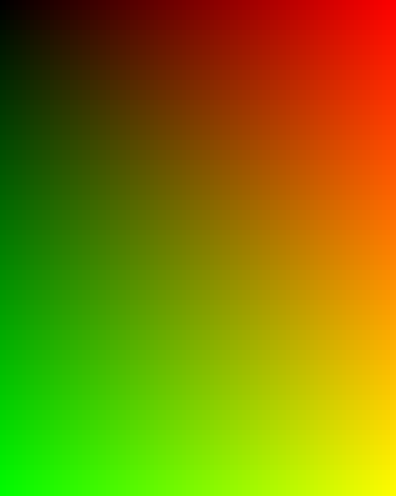
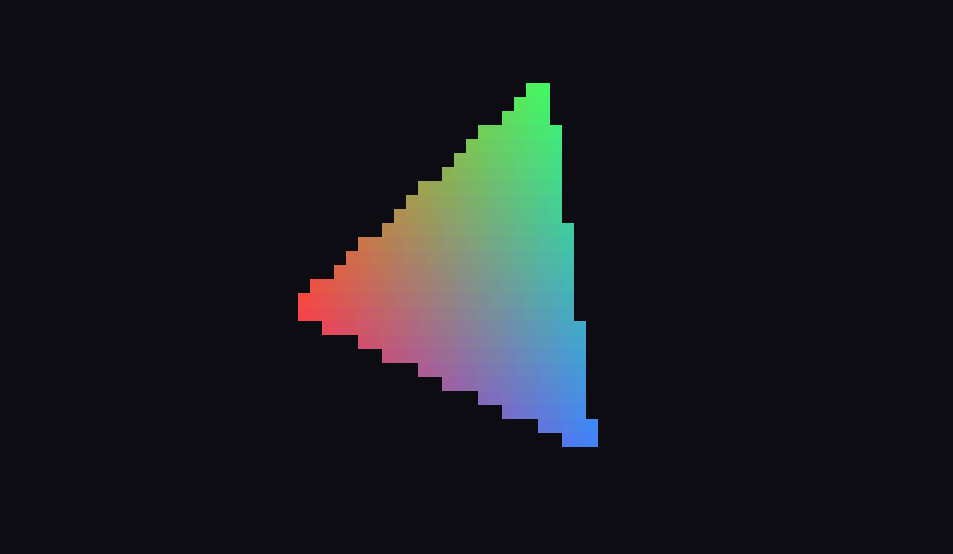
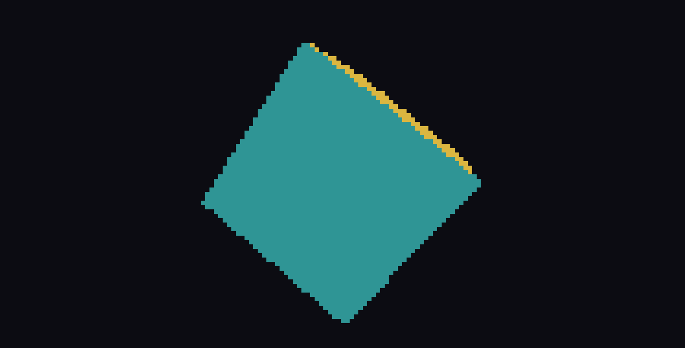
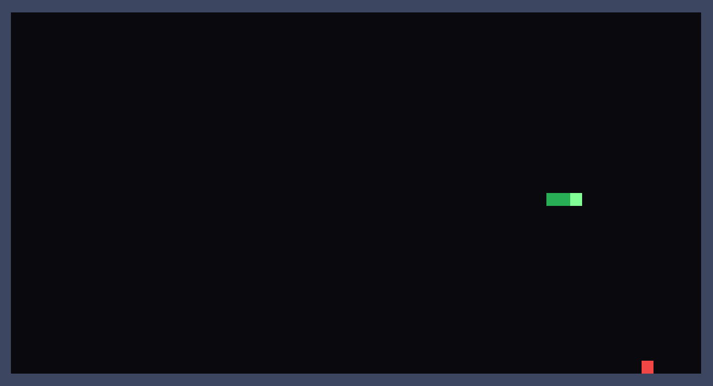
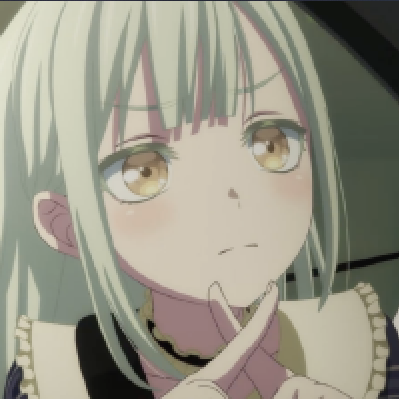
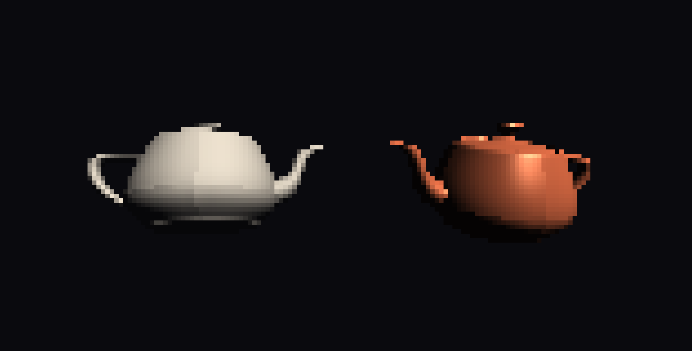
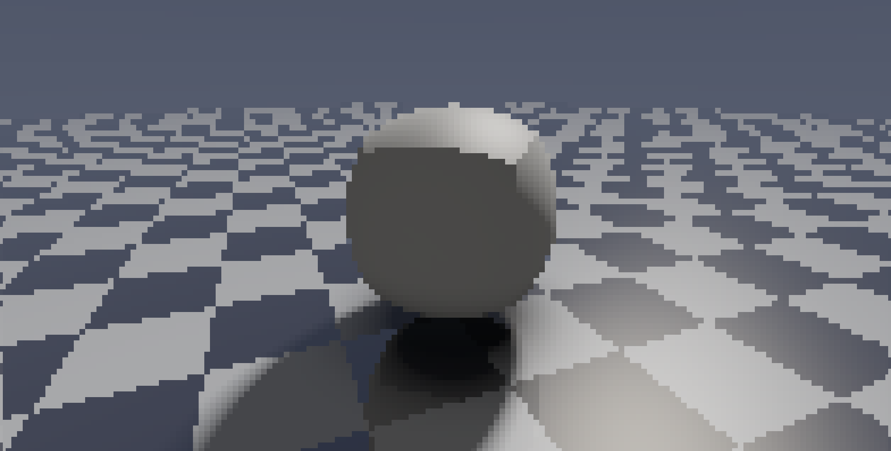
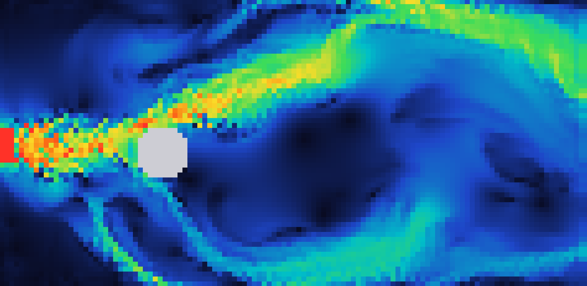

# ANSI Samples

一组使用 ANSI 转义序列在终端里做实时图形与交互的小例子。所有渲染都以“背景色方块”为单位（每个像素 `Renderer` 会输出两个空格），支持真彩色（24-bit）。

## 环境要求

- CMake 3.16+
- 支持 C++17 的编译器（MSVC / GCC / Clang）
- 一个支持真彩色 ANSI 的终端（Windows Terminal、大部分 Linux/macOS 终端）

## 构建

```sh
cmake -S . -B build
cmake --build build
```

也可以只构建某个例子：

```sh
cmake --build build --target 03_cube
```

可执行文件输出在 `build/samples/`。Windows 下为 `*.exe`，运行例如：

```sh
build\samples\03_cube.exe
```

`04_snake` 与 `08_fluid` 支持按键交互（`Q` / `Esc` 退出），其余动画样例按 `Ctrl+C` 退出。

## 头文件

| 文件 | 说明 |
| --- | --- |
| `color.hpp` | `Color` 结构体、`RESET`、后台色转义输出辅助函数 |
| `math.hpp` | `Vec2` / `Vec3`、`dot` / `cross` / `normalize` / `rotate` / `edge` 等数学工具 |
| `terminal.hpp` | 光标定位、隐藏/显示光标、清屏，以及 RAII 的 `CursorGuard` |
| `renderer.hpp` | `Renderer`：像素帧缓冲、`set_pixel`、带脏像素 diff 的 `present` |
| `raster.hpp` | `fill_triangle`：基于重心坐标、可做顶点颜色插值的三角形光栅化 |
| `input.hpp` | `Key` 枚举、`Input`：非阻塞按键读取（Windows `conio` / POSIX `termios`）、`sleep_ms` |
| `ansi.hpp` | 聚合头，包含以上全部 |

## 示例

| # | 预览 | 文件 | 说明 |
| --- | --- | --- | --- |
| 01 |  | `01_hello.cpp` | 最小示例。不依赖库，直接输出一张 RGB 渐变图，并展示最基础的 ANSI 后台色写法。 |
| 02 |  | `02_triangle.cpp` | 旋转的三角形，使用重心坐标对三个顶点颜色做插值。80x40 网格。 |
| 03 |  | `03_cube.cpp` | 旋转立方体。透视投影、背面剔除、画家算法排序、按法线的简单光照。160x80 网格。 |
| 04 |  | `04_snake.cpp` | 可交互的贪吃蛇游戏。60x30 网格，WASD / 方向键控制，吃食物变长，撞墙或撞自己结束，结束后 `R` 重开、`Q` 退出。 |
| 05 |  | `05_image.cpp` | 用 stb_image 加载 `assets/image.png`，盒式降采样后按终端宽高比缩放显示（最大 140x70）。 |
| 06 |  | `06_obj.cpp` | 用 tiny_obj_loader 加载 `assets/teapot.obj`，自动计算平滑法线，使用透视校正插值与 z-buffer，逐像素 Blinn-Phong 着色。同一场景并排渲染 2 个茶壶（各自相位不同），每个茶壶使用不同材质（石膏/铜交替）。 |
| 07 |  | `07_raymarch.cpp` | Raymarching 实时场景：模型在立方体与球体之间循环变形并自转，镜面棋盘地面，含软阴影、环境光遮蔽、Fresnel 高光与一次反射。相机自动环绕。120x60 网格。 |
| 08 |  | `08_fluid.cpp` | 基于欧拉网格法的 2D 稳定流体模拟（MacCormack 平流 + 压力投影 + 涡量约束）。左侧喷口以恒定参数向右喷射流体，击中圆形障碍产生涡流脱落，右侧为开放出口（压力 Dirichlet + 零梯度速度）。可用速度热力图或涡量发散色标显示（Space 切换）。160x80 网格。 |

`05_image` 和 `06_obj` 的资源路径默认由 CMake 通过 `ASSET_DIR` 宏注入，也可以在命令行覆盖：

```sh
build\samples\05_image.exe path\to\image.png
build\samples\06_obj.exe path\to\model.obj
```

## 第三方库

- [stb_image](https://github.com/nothings/stb) — 图片解码，位于 `externals/stb`
- [tiny_obj_loader](https://github.com/tinyobjloader/tinyobjloader) — OBJ 模型加载，位于 `externals/tiny_obj_loader.h`

## 相关库与参考

本项目是一个从零实现的教学示例。如果要在实际项目里做终端界面 / 图形，下面这些库更完整：

| 库 | 语言 | 特点 |
| --- | --- | --- |
| [FTXUI](https://github.com/ArthurSonzogni/FTXUI) | C++ | 现代组件式 TUI：布局、widget、Canvas（Braille / 块字符）、truecolor、事件循环 |
| [notcurses](https://github.com/dankamongmen/notcurses) | C | 功能最全的终端图形库：truecolor、sprite、像素级渲染，可直接显示图片 |
| [libcaca](http://caca.zoy.org/wiki/libcaca) | C | 彩色字符画，把图片 / 视频转成 ASCII / ANSI |
| [chafa](https://hpjansson.org/chafa/)（libchafa） | C | 把图片高质量转成 ANSI / kitty / sixel / 字符画 |
| [termbox2](https://github.com/termbox/termbox2) | C | 轻量、单头文件的 TUI 输入输出封装 |
| [cpp-terminal](https://github.com/jupyter-xeus/cpp-terminal) | C++ | 跨平台终端控制（光标、颜色、raw mode 等） |
| [rang](https://github.com/agauniyal/rang) / [termcolor](https://github.com/ikalnytskyi/termcolor) | C++ | 单头文件的彩色文本（ANSI 前景 / 背景色） |
| [ImTui](https://github.com/ggerganov/imtui) | C++ | 在终端里运行 Dear ImGui |
| [ncurses](https://invisible-island.net/ncurses/) / [PDCurses](https://github.com/wmcbrine/PDCurses) | C | 经典 curses 库（Windows 可用 PDCurses） |

补充：

- 想要**高分辨率图像**，可以了解 **Sixel**、**Kitty graphics protocol**、**iTerm2 inline images** 等终端图形协议。
- 图像转字符可以看 **libcaca** / **chafa**；要完全程序化绘制并控制每个单元格，**notcurses** 和 **FTXUI** 是最成熟的选择。

